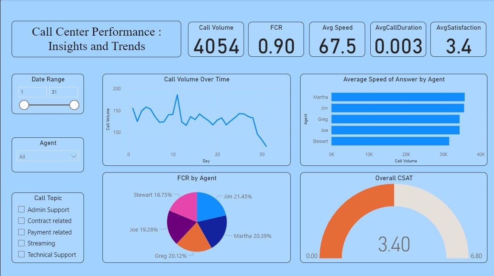

# Call Center Performance Power BI Dashboard

## Overview
This project showcases a Power BI dashboard designed to analyze call center trends and performance metrics. The dashboard provides valuable insights for management discussions and strategic decision-making.

## Key Features
- **Call Volume Analysis:** Track call volume trends over time to identify peak periods.
- **First Call Resolution Rate (FCR):** Measure the percentage of issues resolved on the first call to assess efficiency.
- **Average Speed of Answer:** Monitor how quickly calls are answered by agents.
- **Average Talk Duration:** Analyze the average length of customer interactions.
- **Customer Satisfaction Score (CSAT):** Monitor customer feedback to ensure high service quality.

## Deliverables
- Interactive Power BI dashboard file (`call_center_dashboard.pbix`)
- Sample dataset (`call_center_data.xlsx`)
- README file providing project overview and instructions

## Usage
1. Download or clone the repository.
2. Open the `call_center_dashboard.pbix` file in Power BI Desktop.
3. Refresh the data or replace the sample dataset with your own.
4. Explore the dashboard visuals and interact with slicers for dynamic filtering.

## Feedback
Feedback and suggestions are welcome! Feel free to open an issue or reach out with any questions or improvements.

## License
This project is licensed under the MIT License. See the [LICENSE](LICENSE) file for details.

